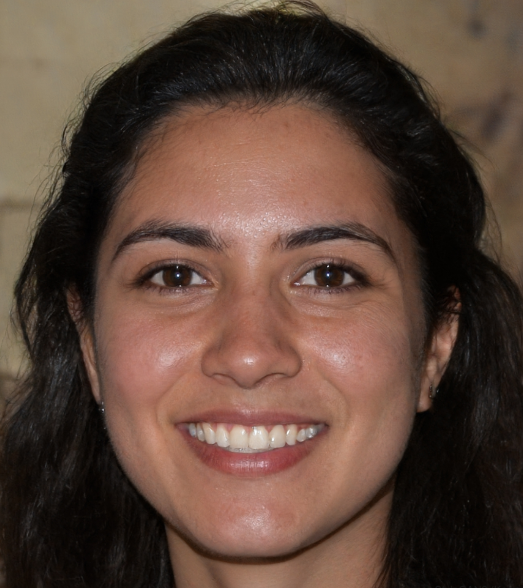
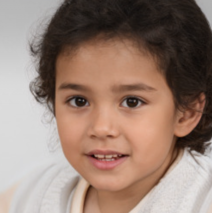
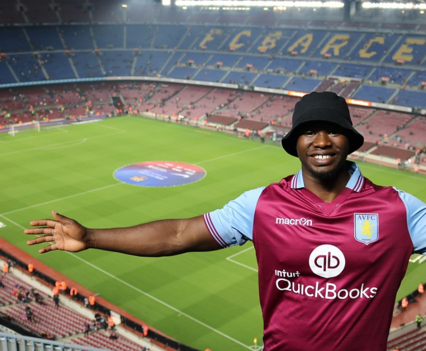

# Sample Person

Our sample person is Rosie:

Rosie is 39, she's an academic in social sciences. She's got a daughter called Alice:

Alice is 3 years old and goes to nursery school.

Rosie's partner is Miguel:

Miguel's also 39, and he and Rosie met at university. Miguel works in epidemiology.

Rosie's mum is Grace:

Grace is a retired child psychologist and she loves sewing.

Rosie's dad is Jim:

Jim's a retired history teacher, his retirement project is writing a history of the family.

Rosie's brother is Tom:

He was a analyst with bank, but he just got made redundant and is having a hard time.

Simon is Miguel's best friend, he's a big fan of Aston Villa FC